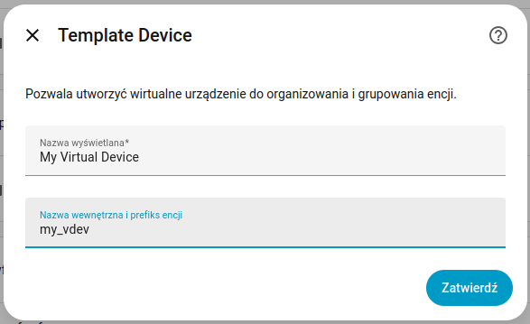

# Template Device

This Home Assistant integration allows you to create **virtual devices** and assign any entities to them.

Additionally, it enables assigning **any entity to any existing device**, regardless of which integration it comes from.

It is especially useful when you want to:

- Group related entities under a single device
- Reorganize entities independently of their original integration
- Assign entities to existing devices that they were not originally linked to
- Improve clarity and structure in the Home Assistant UI

## Installation

This integration is installed via **HACS**:

1. Click the button above to open the repository in HACS.
2. Click **Download** to download the integration.
3. Restart Home Assistant.

**Note:** Alternatively, you can add `https://github.com/catgiggle/HomeAssistant-TemplateDevice` as a custom repository
under **HACS → Integrations**.

## Configuration

1. Click the button above or go to **Settings → Devices & Services → Add Integration** and search for **Template
   Device**.
2. Configure the instance parameters:

You can add **multiple instances** of this integration. Each instance represents a virtual device.

| Parameter       | Description                                                        |
|-----------------|--------------------------------------------------------------------|
| `Display name`  | Name shown in the Home Assistant UI.                               |
| `Internal name` | Unique identifier used as an entity prefix and internal reference. |

## Features

- Create virtual devices in Home Assistant
- Assign any entity to any device (including existing devices)
- Assign entities across different integrations
- Remove entity assignments at any time
- Organize entities independently of their source integration
- Improve UI clarity by grouping related entities
- Works with all entity types

## Services

This integration provides the following services:

### `assign`

Assigns an entity to a device.

| Field       | Description          |
|-------------|----------------------|
| `entity_id` | The entity to assign |
| `device_id` | The target device    |

### `unassign`

Removes an entity from its assigned device.

| Field       | Description            |
|-------------|------------------------|
| `entity_id` | The entity to unassign |

### `status`

Returns the assignment status of entities and devices.

- Returns `"ok"` if the entity exists
- Returns `"unavailable"` if the entity or device does not exist

## Notes

- This integration does not modify original entities or their source integrations.
- Assignments are purely organizational and affect how devices are presented in Home Assistant.
- Removing the integration does not modify original entities.
- The integration requires at least one configured instance (virtual device) **or** a YAML configuration entry to
  initialize properly.
